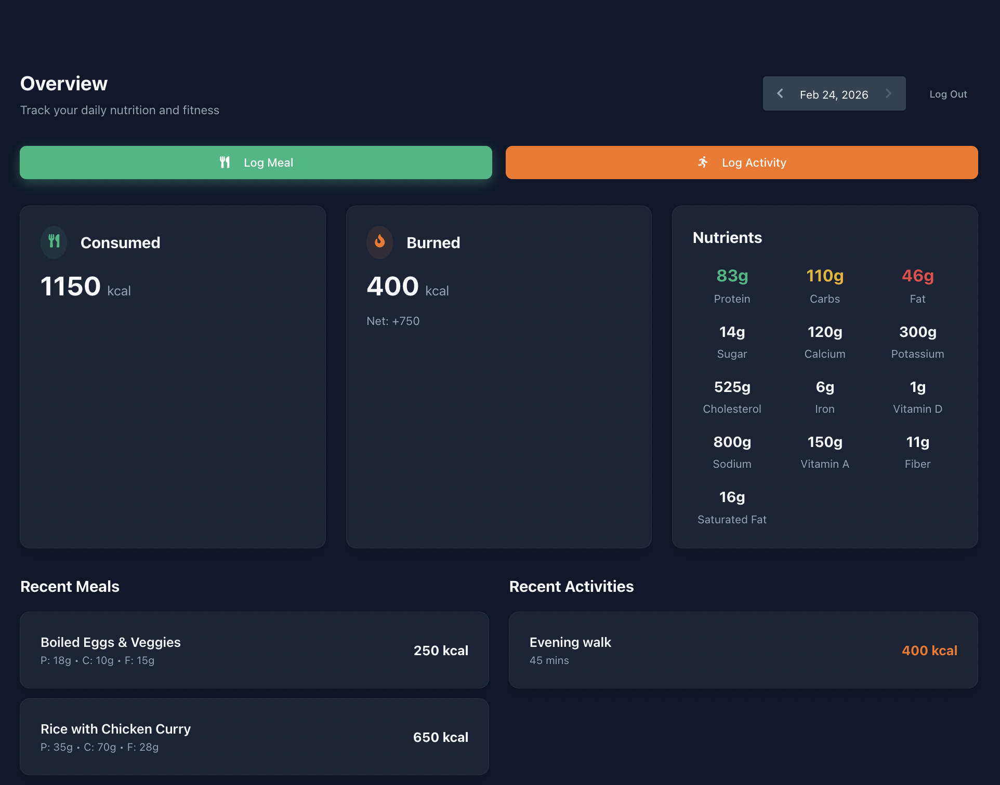
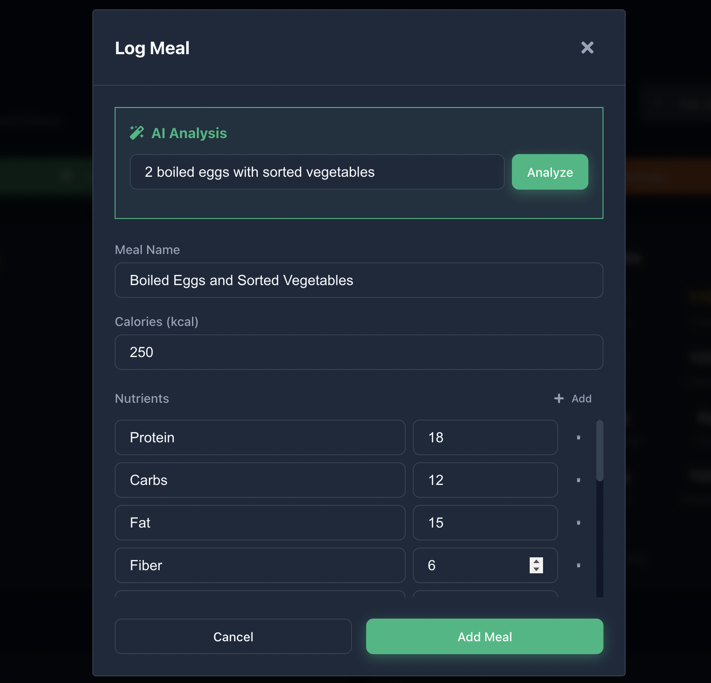
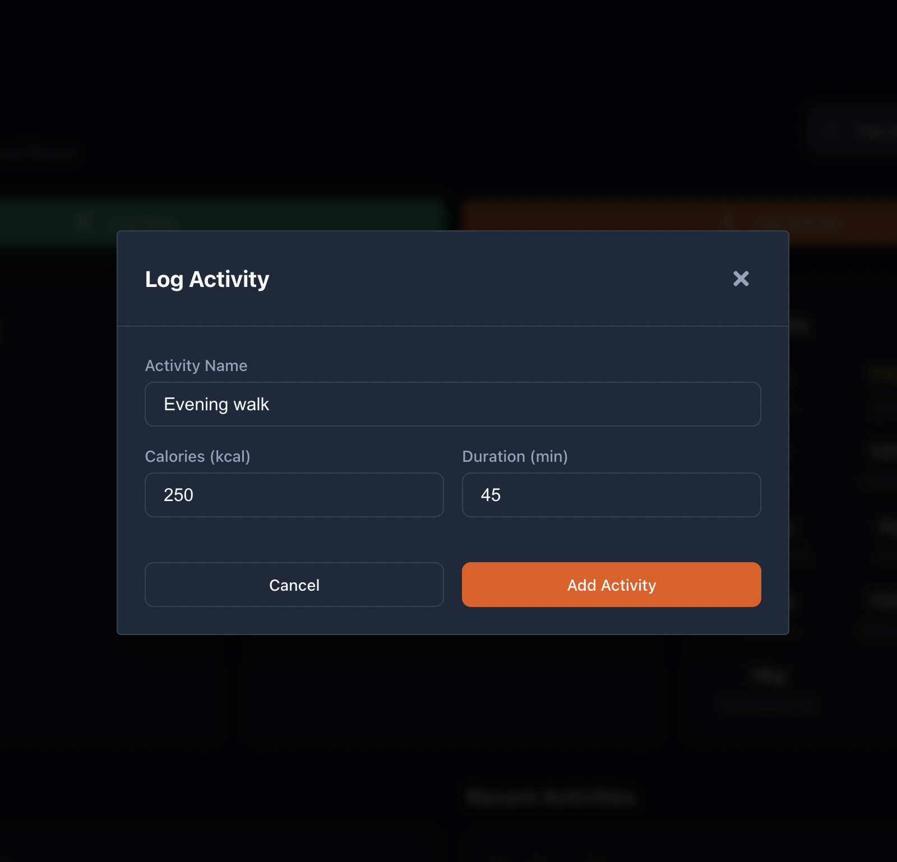
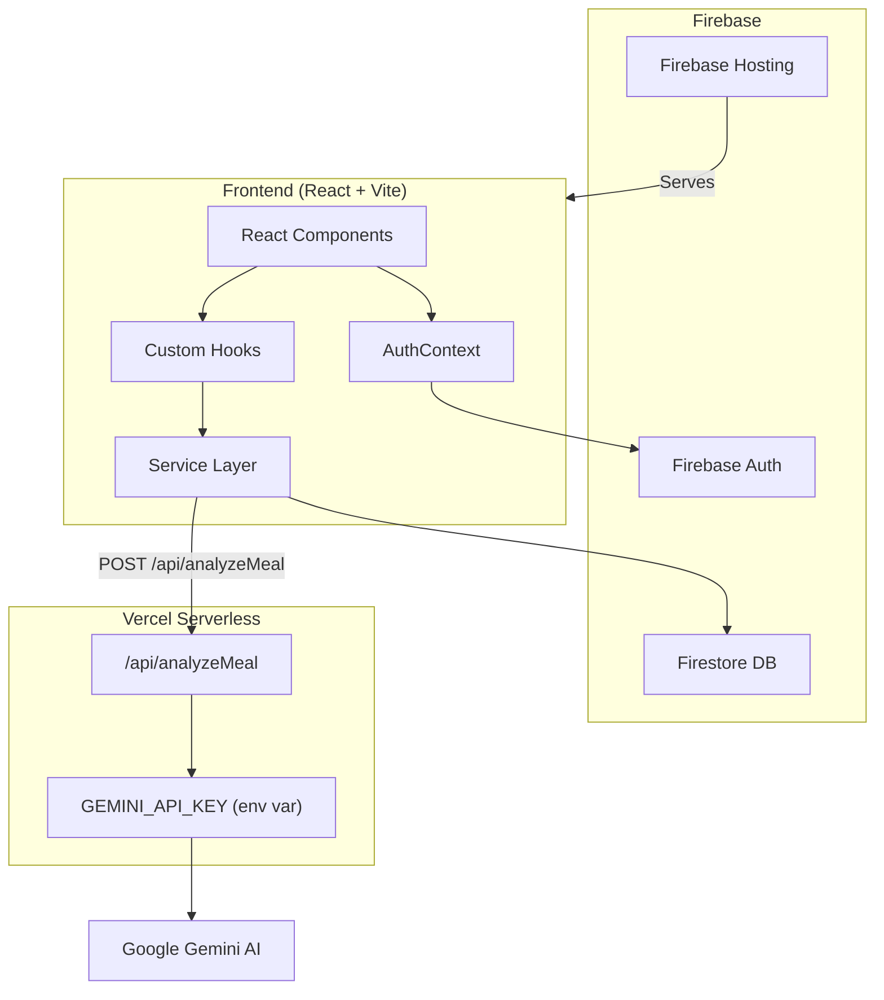

# 🌿 Live Well

> AI-powered health & nutrition tracker built with React, Firebase, and Google Gemini.

Track your daily meals, log activities, and get **instant AI-powered nutritional breakdowns** — all in one clean, dark-themed dashboard.

🔗 **Live Demo**: [livewell-159f8.web.app](https://livewell-159f8.web.app)

---

## 📸 Screenshots

<p align="center">
  
  <br />
  <em>Daily dashboard — calories, nutrients, meals & activities at a glance</em>
</p>

<p align="center">
  
  &nbsp;&nbsp;
  
  <br />
  <em>AI meal analysis (left) • Activity logging (right)</em>
</p>

---

## ✨ Features

| Feature | Description |
|---------|-------------|
| 🤖 **AI Meal Analysis** | Describe your meal in plain text → Gemini AI returns calories, protein, carbs, fat, and 10+ micronutrients |
| 🍽️ **Meal Tracking** | Log meals with detailed calorie and nutrient breakdowns |
| 🏃 **Activity Logging** | Record workouts with calorie burn and duration |
| 📊 **Nutrient Dashboard** | View macros (protein, carbs, fat) and micros (fiber, sodium, iron, calcium, etc.) |
| 📅 **Date Navigation** | Browse nutrition and activity history day-by-day |
| 🔐 **Authentication** | Email/password + Google Sign-In via Firebase Auth |
| 🔒 **Secure API** | Gemini API key proxied through Vercel serverless function — never exposed client-side |

---

## 🏗️ Architecture



### Data Flow

```
User describes meal → Frontend POST → Vercel Proxy → Gemini API → Nutritional JSON → Frontend renders
```

### Project Structure

```
src/
├── components/
│   ├── common/        # Button, Card, Input, Modal, DateSelector
│   ├── forms/         # AddMealForm, AddActivityForm
│   └── layout/        # App layout components
├── context/
│   └── AuthContext.jsx # Firebase Auth (email + Google)
├── hooks/
│   └── useDailyData.js # Aggregates daily meals & activities
├── pages/
│   ├── Landing.jsx     # Marketing landing page
│   ├── Dashboard.jsx   # Main app dashboard
│   ├── Login.jsx       # Login (email + Google)
│   └── Signup.jsx      # Registration (email + Google)
├── services/
│   ├── firebase.js     # Firebase config & initialization
│   ├── firestoreService.js # Firestore CRUD operations
│   └── aiService.js    # Gemini API proxy client
└── styles/
    └── variables.css   # Design system tokens

vercel-proxy/
└── api/
    └── analyzeMeal.js  # Serverless function (Gemini API proxy)
```

---

## 🛠️ Tech Stack

| Layer | Technology |
|-------|-----------|
| **Frontend** | React 19, Vite 7, React Router 7 |
| **Styling** | CSS Variables, Glassmorphism, Custom Design System |
| **Auth** | Firebase Authentication (Email + Google) |
| **Database** | Cloud Firestore |
| **AI** | Google Gemini 2.0 Flash Lite |
| **API Proxy** | Vercel Serverless Functions |
| **Hosting** | Firebase Hosting (frontend), Vercel (API) |
| **Icons** | react-icons |

---

## 🚀 Getting Started

### Prerequisites

- Node.js 18+
- Firebase project ([create one](https://console.firebase.google.com))
- Google Gemini API key ([get one](https://aistudio.google.com/apikey))
- Vercel account ([sign up](https://vercel.com))

### 1. Clone & Install

```bash
git clone https://github.com/johanreji/livewell.git
cd livewell
npm install
```

### 2. Configure Environment Variables

Create a `.env` file in the root:

```env
VITE_FIREBASE_API_KEY=your_firebase_api_key
VITE_FIREBASE_AUTH_DOMAIN=your_project.firebaseapp.com
VITE_FIREBASE_PROJECT_ID=your_project_id
VITE_FIREBASE_STORAGE_BUCKET=your_project.firebasestorage.app
VITE_FIREBASE_MESSAGING_SENDER_ID=your_sender_id
VITE_FIREBASE_APP_ID=your_app_id
VITE_API_URL=your_vercel_deployment_url
```

### 3. Set Up Firebase

1. Enable **Email/Password** and **Google** sign-in methods in Firebase Console → Authentication
2. Create a **Firestore** database in production mode
3. Set Firestore security rules to restrict access by `userId`

### 4. Deploy the Vercel Proxy

```bash
cd vercel-proxy
npm install
npx vercel --prod
```

Set `GEMINI_API_KEY` as an environment variable in your Vercel project settings.

### 5. Run Locally

```bash
npm run dev
```

### 6. Deploy Frontend

```bash
npm run build
npx firebase deploy
```

---

## 🔐 Security

- **Gemini API key** is stored server-side in Vercel environment variables — never sent to the browser
- **Firebase API key** is safe to expose (it's restricted by Firebase security rules and auth)
- **Firestore rules** enforce data ownership — users can only read/write their own data
- **CORS** restricted to production domain and localhost for development

---

## 📄 License

This project is open source and available under the [MIT License](LICENSE).

---

<p align="center">
  Built with ❤️ by <a href="https://github.com/johanreji">Johan Reji</a>
</p>
